<h2>
EfficientDet-Slightly-Realistic-USA-RoadSigns-160classes (Updated: 2022/06/29)
</h2>

This is a slightly realistic project to train and detect RoadSigns in US based on 
<a href="https://github.com/google/automl/tree/master/efficientdet">Google Brain AutoML efficientdet</a>.
 
Please also refer to our experimental project <a href="https://github.com/atlan-antillia/EfficientDet-Realistic-USA-RoadSigns">EfficientDet-Realistic-USA-RoadSigns</a>.
 
<li>
Modified to use the TFRecord_USA_RoadSigns_160classes_V2 in
<a href="https://drive.google.com/drive/folders/1ht0J3WnqNWXqfHT4QzzZ5xPheYpnhRWW?usp=sharing">USA_RoadSigns_160classes_V2</a>
 
</li>
<li>
Modified to write the COCO metrics(f, map and mar) of inference for <b>realistic_test_dataset</b> to <a href="./projects/USA_RoadSigns/realistic_test_dataset_outputs/prediction_f_map_mar.csv">
prediction_f_map_mar.csv</a> file (2022/06/05). 
</li>
<li>
Modified to use tensorflow 2.8.0 on Windows11 (2022/06/18) 
</li>
<li>
Modified to use the latest <a href="https://github.com/google/automl/tree/master/efficientdet">google/automl/efficientdet</a>.(2022/06/12) 
</li>
<li>
Modified to use mixed_size tfrecord dataset.(2022/06/29) 
</li>
 
<h2>
1. Installing tensorflow on Windows11
</h2>
We use Python 3.8.10 to run tensoflow 2.8.0 on Windows11. 
<h3>1.1 Install Microsoft Visual Studio Community</h3>
Please install <a href="https://visualstudio.microsoft.com/ja/vs/community/">Microsoft Visual Studio Community</a>, 
which can be used to compile source code of 
<a href="https://github.com/cocodataset/cocoapi">cocoapi</a> for PythonAPI. 
<h3>1.2 Create a python virtualenv </h3>
Please run the following command to create a python virtualenv of name <b>py38-efficientdet</b>.
<pre>
>cd c:\
>python38\python.exe -m venv py38-efficientdet
>cd c:\py38-efficientdet
>./scripts/activate
</pre>
<h3>1.3 Create a working folder </h3>
Please create a working folder "c:\google" for your repository, and install the python packages. 

<pre>
>mkdir c:\google
>cd    c:\google
>pip install cython
>git clone https://github.com/cocodataset/cocoapi
>cd cocoapi/PythonAPI
</pre>
You have to modify extra_compiler_args in setup.py in the following way:
<pre>
   extra_compile_args=[]
</pre>
<pre>
>python setup.py build_ext install
</pre>

 
<h2>
2. Installing EfficientDet-Realistic-USA-RoadSigns-160classes
</h2>
<h3>2.1 Clone repository</h3>
Please clone EfficientDet-Slightly-Realistic-USA-RoadSigns-160classes.git in the working folder <b>c:\google</b>. 
<pre>
>git clone https://github.com/atlan-antillia/EfficientDet-Slightly-Realistic-USA-RoadSigns-160classes.git 
</pre>
You can see the following folder <b>projects</b> in  EfficientDet-Slightly-Realistic-USA-RoadSigns-160classes of the working folder. 

<pre>
EfficientDet-Slightly-Realistic-USA-RoadSigns-160classes
└─projects
    └─USA_RoadSigns
        ├─eval
        ├─saved_model
        │  └─variables
        ├─realistic_test_dataset
        └─realistic_test_dataset_outputs
</pre>
<h3>2.2 Install python packages</h3>

Please run the following command to install python packages for this project. 
<pre>
>cd ./EfficientDet-Slightly-Realistic-USA-RoadSigns-160classes
>pip install -r requirements.txt
</pre>

 
<h3>2.3 Download TFRecord dataset</h3>
 You can download TRecord_USA_RoadSigns 160classes_V2.1 (2022/06/29) dataset from 
<a href="https://drive.google.com/file/d/1qAD_wgzNIOP6Ds6Czq1sPY-jHarBggXe/view?usp=sharing">USA_RoadSigns_160classes_V2.1</a>
 
The downloaded train and valid dataset must be placed in ./projects/USA_RoadSigns folder.
<pre>
└─projects
    └─USA_RoadSigns
        ├─train
        └─valid
</pre>
The train and valid folders contain the following tfrecord files: 
<pre>
    └─USA_RoadSigns
        ├─train
        │  └─mixed_size_train.tfrecord
        │  └─train.tfrecord
        └─valid
           └─mixed_size_valid.tfrecord
           └─valid.tfrecord
</pre>
We have newly added the tfrecord files, <b>mixed_size_train.tfrecord</b> and <b>mixed_size_valid.tfrecord</b>,
to improve inference accuracy to the realistic_test_dataset. 
 

<h3>2.4 Workarounds for Windows</h3>
As you know or may not know, the efficientdet scripts of training a model and creating a saved_model do not 
run well on Windows environment in case of tensorflow 2.8.0 (probably after the version 2.5.0) as shown below:. 
<pre>
INFO:tensorflow:Saving checkpoints for 0 into ./models\model.ckpt.
I0609 06:22:50.961521  3404 basic_session_run_hooks.py:634] Saving checkpoints for 0 into ./models\model.ckpt.
2022-06-09 06:22:52.780440: W tensorflow/core/framework/op_kernel.cc:1745] OP_REQUIRES failed at save_restore_v2_ops.cc:110 :
 NOT_FOUND: Failed to create a NewWriteableFile: ./models\model.ckpt-0_temp\part-00000-of-00001.data-00000-of-00001.tempstate8184773265919876648 :
</pre>

The real problem seems to happen in the original <b> save_restore_v2_ops.cc</b>. The simple workarounds to the issues are 
to modify the following tensorflow/python scripts in your virutalenv folder. 
<pre>
c:\py38-efficientdet\Lib\site-packages\tensorflow\python\training
 +- basic_session_run_hooks.py
 
634    logging.info("Saving checkpoints for %d into %s.", step, self._save_path)
635    ### workaround date="2022/06/18" os="Windows"
636    import platform
637    if platform.system() == "Windows":
638      self._save_path = self._save_path.replace("/", "\\")
639    #### workaround
</pre>

<pre>
c:\py38-efficientdet\Lib\site-packages\tensorflow\python\saved_model
 +- builder_impl.py

595    variables_path = saved_model_utils.get_variables_path(self._export_dir)
596    ### workaround date="2022/06/18" os="Windows" 
597    import platform
598    if platform.system() == "Windows":
599      variables_path = variables_path.replace("/", "\\")
600    ### workaround
</pre>
 
<h3>3. Inspect tfrecord</h3>
  Move to ./projects/USA_RoadSigns directory, and run the following bat file: 
<pre>
tfrecord_inspect.bat
</pre>
, which is the following:
<pre>
python ../../TFRecordInspector.py ^
  ./train/*.tfrecord ^
  ./label_map.pbtxt ^
  ./Inspector/train
</pre>
 
This will generate annotated images with bboxes and labels from the tfrecord, and cout the number of annotated objects in it. 
 
<b>TFRecordInspecotr: annotated images in train.tfrecord</b> 
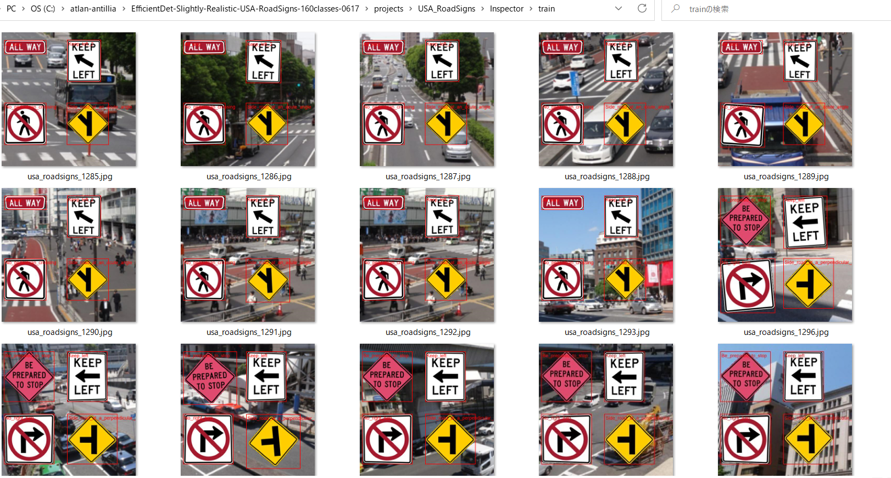
 
 
<b>TFRecordInspecotr: objects_count train.tfrecord</b> 
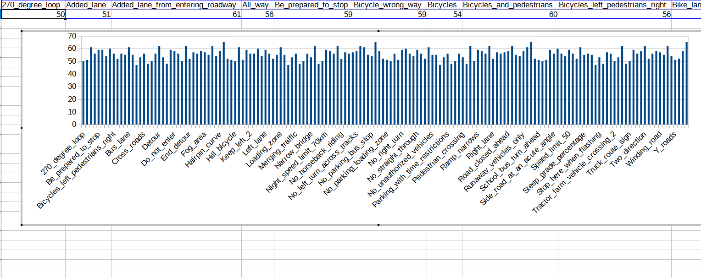
 
This bar graph shows that the number of the objects contained in train.tfrecord.
 
 
 
<h3>4. Downloading the pretrained-model efficientdet-d0</h3>
Please download an EfficientDet model chekcpoint file <b>efficientdet-d0.tar.gz</b>, and expand it in <b>EfficientDet-USA-RoadSigns</b> folder. 
 
https://storage.googleapis.com/cloud-tpu-checkpoints/efficientdet/coco2/efficientdet-d0.tar.gz
 
See: https://github.com/google/automl/tree/master/efficientdet 

<h3>5. Training USA RoadSigns Model by using pretrained-model</h3>
Please change your current directory to <b>./projects/USA_RoadSigns</b>,
and run the following bat file to train USA-Roadsigns Efficientdet Model by using the train and valid tfrecords.
<pre>
1_train.bat
</pre>

<pre>
rem 1_train.bat: modified --model_dir
python ../../ModelTrainer.py ^
  --mode=train_and_eval ^
  --train_file_pattern=./train/*.tfrecord  ^
  --val_file_pattern=./valid/*.tfrecord ^
  --model_name=efficientdet-d0 ^
  --hparams="input_rand_hflip=False,image_size=512x512,num_classes=160,label_map=./label_map.yaml" ^
  --model_dir=./models ^
  --label_map_pbtxt=./label_map.pbtxt ^
  --eval_dir=./eval ^
  --ckpt=../../efficientdet-d0  ^
  --train_batch_size=4 ^
  --early_stopping=map ^
  --patience=10 ^
  --eval_batch_size=1 ^
  --eval_samples=1000  ^
  --num_examples_per_epoch=2000 ^
  --num_epochs=160 
</pre>

<table style="border: 1px solid #000;">
<tr>
<td>
--mode</td><td>train_and_eval</td>
</tr>
<tr>
<td>
--train_file_pattern</td><td>./train/*.tfrecord</td>
</tr>
<tr>
<td>
--val_file_pattern</td><td>./valid/*.tfrecord</td>
</tr>
<tr>
<td>
--model_name</td><td>efficientdet-d0</td>
</tr>
<tr><td>
--hparams</td><td>"input_rand_hflip=False,num_classes=160,label_map=./label_map.yaml"
</td></tr>
<tr>
<td>
--model_dir</td><td>./models</td>
</tr>
<tr><td>
--label_map_pbtxt</td><td>./label_map.pbtxt
</td></tr>

<tr><td>
--eval_dir</td><td>./eval
</td></tr>

<tr>
<td>
--ckpt</td><td>../../efficientdet-d0</td>
</tr>
<tr>
<td>
--train_batch_size</td><td>4</td>
</tr>
<tr>
<td>
--early_stopping</td><td>map</td>
</tr>
<tr>
<td>
--patience</td><td>10</td>
</tr>

<tr>
<td>
--eval_batch_size</td><td>1</td>
</tr>
<tr>
<td>
--eval_samples</td><td>1000</td>
</tr>
<tr>
<td>
--num_examples_per_epoch</td><td>2000</td>
</tr>
<tr>
<td>
--num_epochs</td><td>160</td>
</tr>
</table>
 
 
<b>label_map.yaml: Updated in V2</b>
<pre>
1: '270_degree_loop'
2: 'Added_lane'
3: 'Added_lane_from_entering_roadway'
4: 'All_way'
5: 'Be_prepared_to_stop'
6: 'Bicycle_wrong_way'
7: 'Bicycles'
8: 'Bicycles_and_pedestrians'
9: 'Bicycles_left_pedestrians_right'
10: 'Bike_lane'
11: 'Bike_lane_slippery_when_wet'
12: 'Bump'
13: 'Bus_lane'
14: 'Center_lane'
15: 'Chevron_alignment'
16: 'Circular_intersection_warning'
17: 'Cross_roads'
18: 'Curve'
19: 'Dead_end'
20: 'Deer_crossing'
21: 'Detour'
22: 'Detour_right'
23: 'Dip'
24: 'Do_not_drive_on_tracks'
25: 'Do_not_enter'
26: 'Do_not_pass_stopped_trains'
27: 'Double_side_roads'
28: 'Emergency_signal'
29: 'End_detour'
30: 'Except_right_turn'
31: 'Fallen_rocks'
32: 'Flagger_present'
33: 'Fog_area'
34: 'Go_on_slow'
35: 'Golf_cart_crossing'
36: 'Gusty_winds_area'
37: 'Hairpin_curve'
38: 'Hazardous_material_prohibited'
39: 'Hazardous_material_route'
40: 'Hidden_driveway'
41: 'Hill_bicycle'
42: 'Horizontal_alignment_intersection'
43: 'Horse_drawn_vehicle_ahead'
44: 'Keep_left'
45: 'Keep_left_2'
46: 'Keep_right'
47: 'Keep_right_2'
48: 'Lane_ends'
49: 'Left_lane'
50: 'Left_turn_only'
51: 'Left_turn_or_straight'
52: 'Left_turn_yield_on_green'
53: 'Loading_zone'
54: 'Low_clearance'
55: 'Low_ground_clearance_railroad_crossing'
56: 'Merge'
57: 'Merging_traffic'
58: 'Metric_low_clearance'
59: 'Minimum_speed_limit_40'
60: 'Minimum_speed_limit_60km'
61: 'Narrow_bridge'
62: 'National_network_prohibited'
63: 'National_network_route'
64: 'Night_speed_limit_45'
65: 'Night_speed_limit_70km'
66: 'No_bicycles'
67: 'No_entre'
68: 'No_hitch_hiking'
69: 'No_horseback_riding'
70: 'No_large_trucks'
71: 'No_left_or_u_turn'
72: 'No_left_turn'
73: 'No_left_turn_across_tracks'
74: 'No_outlet'
75: 'No_parking'
76: 'No_parking_any_time'
77: 'No_parking_bus_stop'
78: 'No_parking_from_830am_to_530pm'
79: 'No_parking_from_830am_to_530pm_2'
80: 'No_parking_in_fire_lane'
81: 'No_parking_loading_zone'
82: 'No_parking_on_pavement'
83: 'No_pedestrian_crossing'
84: 'No_pedestrians'
85: 'No_right_turn'
86: 'No_rollerblading'
87: 'No_standing_any_time'
88: 'No_stopping_on_pavement'
89: 'No_straight_through'
90: 'No_train_horn_warning'
91: 'No_turns'
92: 'No_u_turn'
93: 'No_unauthorized_vehicles'
94: 'Offset_roads'
95: 'One_direction'
96: 'One_way'
97: 'Parking_with_time_restrictions'
98: 'Pass_on_either_side'
99: 'Pass_road'
100: 'Path_narrows'
101: 'Pedestrian_crossing'
102: 'Railroad_crossing'
103: 'Railroad_crossing_ahead'
104: 'Railroad_intersection_warning'
105: 'Ramp_narrows'
106: 'Reserved_parking_wheelchair'
107: 'Reverse_curve'
108: 'Reverse_turn'
109: 'Right_lane'
110: 'Right_turn_only'
111: 'Right_turn_or_straight'
112: 'Road_closed'
113: 'Road_closed_ahead'
114: 'Road_narrows'
115: 'Road_slippery_when_wet'
116: 'Rough_road'
117: 'Runaway_vehicles_only'
118: 'School'
119: 'School_advance'
120: 'School_bus_stop_ahead'
121: 'School_bus_turn_ahead'
122: 'School_speed_limit_ahead'
123: 'Sharp_turn'
124: 'Side_road_at_a_perpendicular_angle'
125: 'Side_road_at_an_acute_angle'
126: 'Single_lane_shift_left'
127: 'Skewed_railroad_crossing'
128: 'Snowmobile'
129: 'Speed_limit_50'
130: 'Speed_limit_80km'
131: 'Stay_in_lane'
132: 'Steep_grade'
133: 'Steep_grade_percentage'
134: 'Stop'
135: 'Stop_here_for_pedestrians'
136: 'Stop_here_for_peds'
137: 'Stop_here_when_flashing'
138: 'Straight_ahead_only'
139: 'T_roads'
140: 'Tractor_farm_vehicle_crossing'
141: 'Tractor_farm_vehicle_crossing_2'
142: 'Truck crossing_2'
143: 'Truck_crossing'
144: 'Truck_rollover_warning'
145: 'Truck_route_sign'
146: 'Truck_speed_limit_40'
147: 'Turn_only_lanes'
148: 'Turning_vehicles_yield_to_pedestrians'
149: 'Two_direction'
150: 'Two_way_traffic'
151: 'Wait_on_stop'
152: 'Weight_limit_10t'
153: 'Winding_road'
154: 'Work_zone_for_speed_limit'
155: 'Workers_on_road'
156: 'Wrong_way'
157: 'Y_roads'
158: 'Yield'
159: 'Yield_here_to_pedestrians'
160: 'Yield_here_to_peds'
</pre>
 
 
<b><a href="./projects/USA_RoadSigns/eval/coco_metrics.csv">COCO metrics at epoch 130</a></b> 
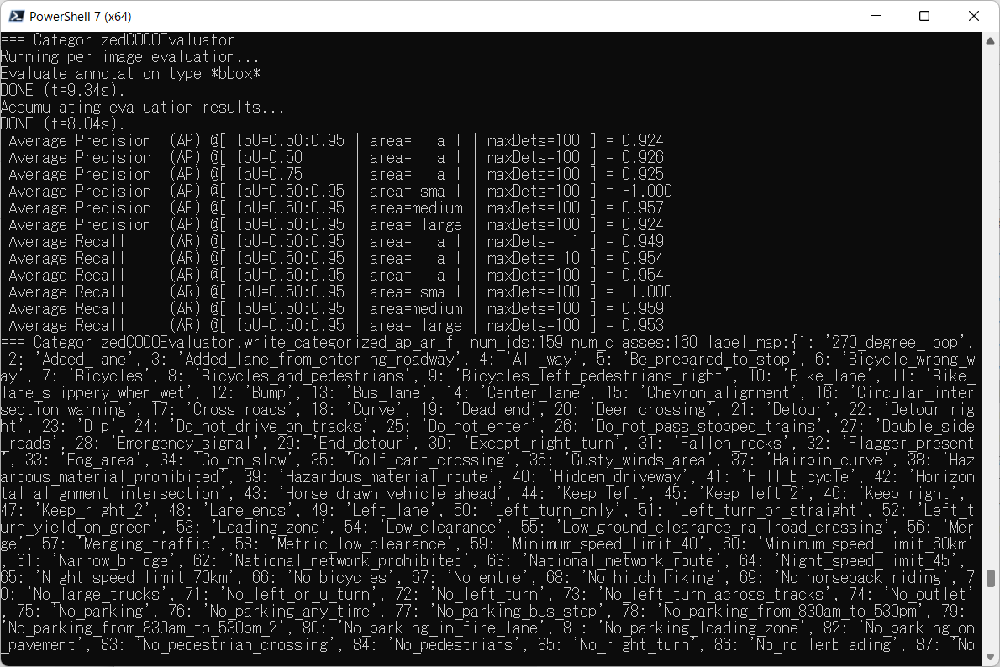
 

 
<b><a href="./projects/USA_RoadSigns/eval/coco_metrics.csv">COCO meticss f and map</a></b> 
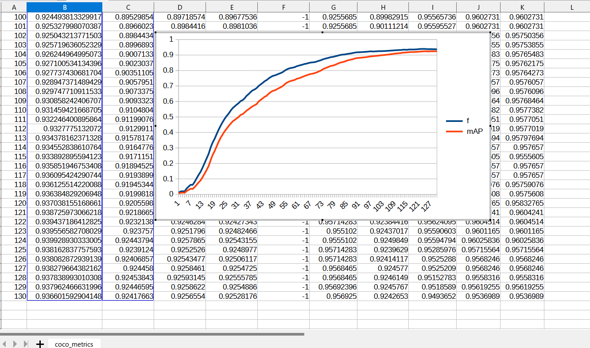
 
 
<b><a href="./projects/USA_RoadSigns/eval/train_losses.csv">Train losses</a></b> 

 
 

<b><a href="./projects/USA_RoadSigns/eval/coco_ap_per_class.csv">COCO ap per class</a></b> 

 

<h3>
6. Create a saved_model from the checkpoint
</h3>
  Please run the following bat file to create a saved_model from the checkpoint files in <b>./models</b> folder.  
<pre>
2_create_saved_model.bat
</pre>
, which is the following:
<pre>
rem 2_create_saved_model.bat  modified 2022/06/18
python ../../SavedModelCreator.py ^
  --runmode=saved_model ^
  --model_name=efficientdet-d0 ^
  --ckpt_path=./models  ^
  --hparams="image_size=512x512,num_classes=160" ^
  --saved_model_dir=./saved_model
</pre>

<table style="border: 1px solid #000;">
<tr>
<td>--runmode</td><td>saved_model</td>
</tr>

<tr>
<td>--model_name </td><td>efficientdet-d0 </td>
</tr>

<tr>
<td>--ckpt_path</td><td>./models</td>
</tr>

<tr>
<td>--hparams</td><td>"image_size=512x512,num_classes=160"</td>
</tr>

<tr>
<td>--saved_model_dir</td><td>./saved_model</td>
</tr>
</table>

 
 
<h3>
7. Inference USA_road_signs by using the saved_model
</h3>
 Please run the following bat file to infer the roadsigns in images of test_dataset:
<pre>
3_inference.bat
</pre>
, which is the folllowing:
<pre>
rem 3_inference.bat
python ../../SavedModelInferencer.py ^
  --runmode=saved_model_infer ^
  --model_name=efficientdet-d0 ^
  --saved_model_dir=./saved_model ^
  --min_score_thresh=0.4 ^
  --hparams="num_classes=160,label_map=./label_map.yaml" ^
  --input_image=./realistic_test_dataset/*.jpg ^
  --classes_file=./classes.txt ^
  --ground_truth_json=./realistic_test_dataset/annotation.json ^
  --output_image_dir=./realistic_test_dataset_outputs
</pre>

<table style="border: 1px solid #000;">
<tr>
<td>--runmode</td><td>saved_model_infer </td>
</tr>
<tr>
<td>--model_name</td><td>efficientdet-d0 </td>
</tr>

<tr>
<td>--saved_model_dir</td><td>./saved_model </td>
</tr>

<tr>
<td>--min_score_thresh</td><td>0.4 </td>
</tr>

<tr>
<td>--hparams</td><td>"num_classes=160,label_map=./label_map.yaml"</td>
</tr>

<tr>
<td>--input_image</td><td>./realistic_test_dataset/*.jpg</td>
</tr>

<tr>
<td>--classes_file</td><td>./classes.txt</td>
</tr>

<tr>
<td>--ground_truth_json</td><td>./realistic_test_dataset/annotation.json</td>
</tr>

<tr>
<td>--output_image_dir</td><td>./realistic_test_dataset_outputs</td>
</tr>
</table>

 
<h3>
8. Some Inference results of USA RoadSigns
</h3>

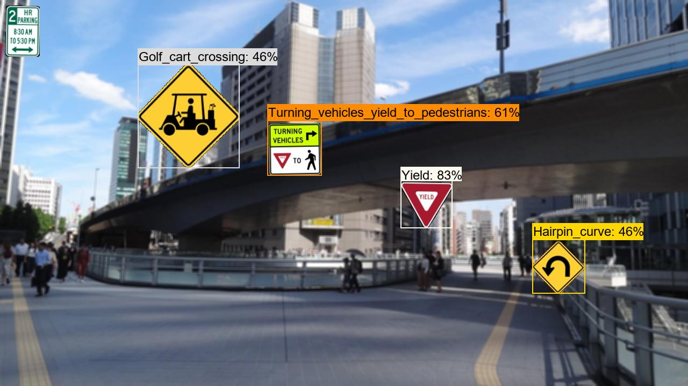 
<a href="./projects/USA_RoadSigns/realistic_test_dataset_outputs/usa_roadsigns_1001.jpg_objects.csv">roadsigns1001.jpg_objects.csv</a> 
 
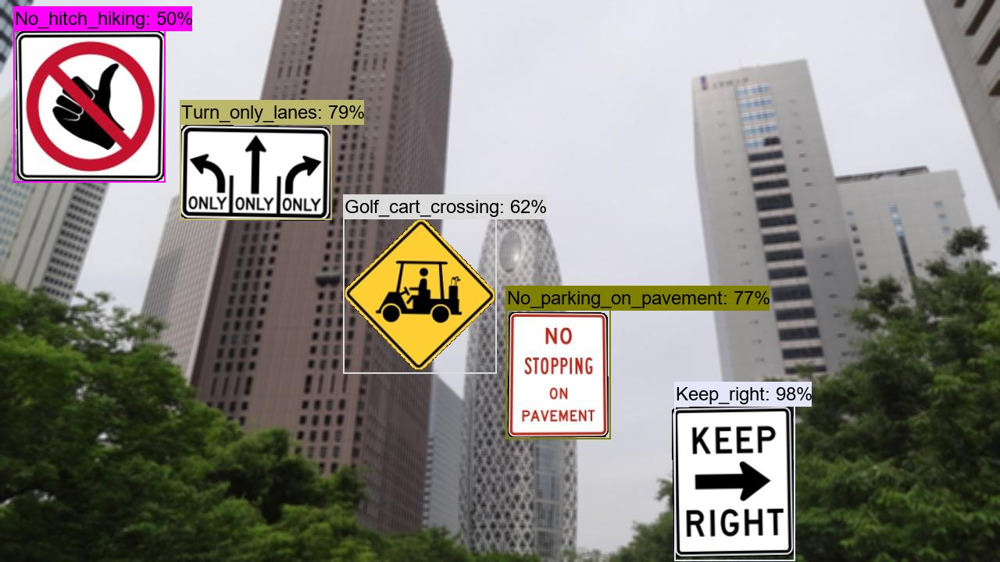 
<a  href="./projects/USA_RoadSigns/realistic_test_dataset_outputs/usa_roadsigns_1012.jpg_objects.csv">roadsigns1002.jpg_objects.csv</a> 
 
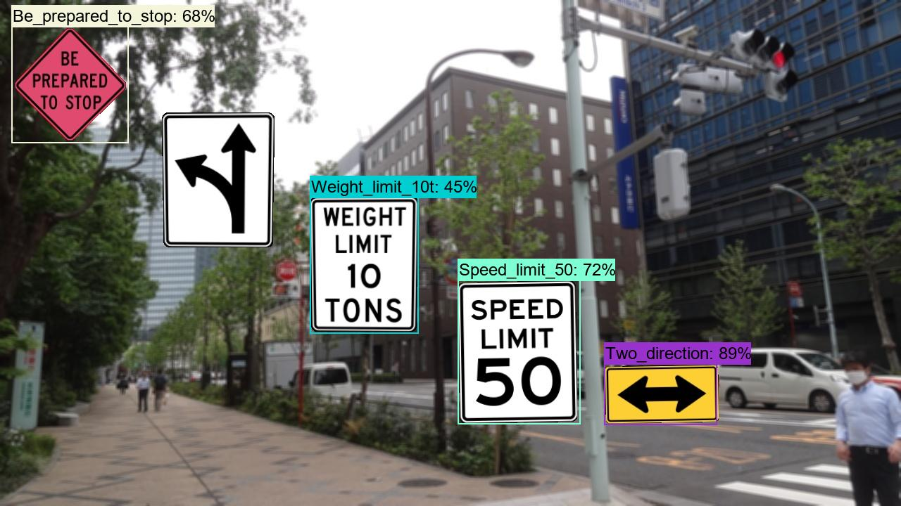 
<a  href="./projects/USA_RoadSigns/realistic_test_dataset_outputs/usa_roadsigns_1023.jpg_objects.csv">roadsigns1003.jpg_objects.csv</a> 
 
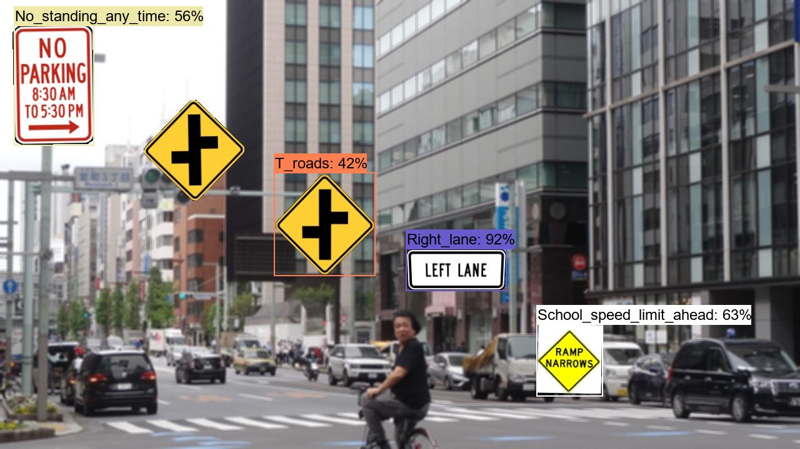 
<a  href="./projects/USA_RoadSigns/realistic_test_dataset_outputs/usa_roadsigns_1034.jpg_objects.csv">roadsigns1004.jpg_objects.csv</a> 
 
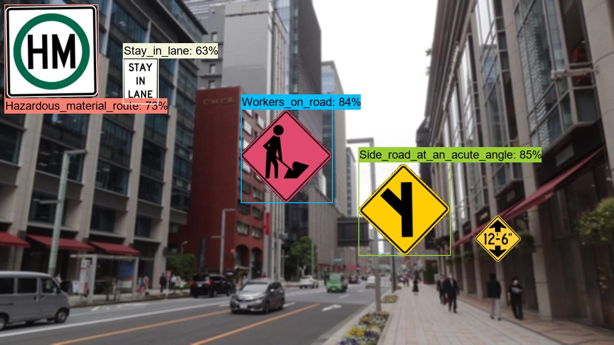 
<a  href="./projects/USA_RoadSigns/realistic_test_dataset_outputs/usa_roadsigns_1045.jpg_objects.csv">roadsigns1005.jpg_objects.csv</a> 
 
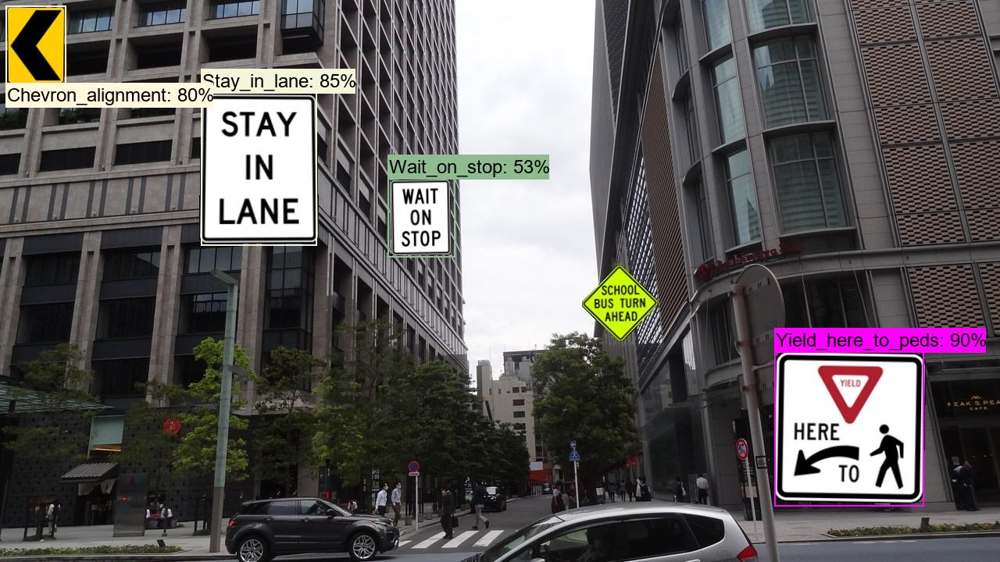 
<a  href="./projects/USA_RoadSigns/realistic_test_dataset_outputs/usa_roadsigns_1056.jpg_objects.csv">roadsigns1006.jpg_objects.csv</a> 
 
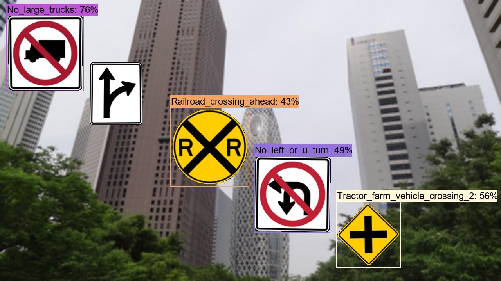 
<a  href="./projects/USA_RoadSigns/realistic_test_dataset_outputs/usa_roadsigns_1067.jpg_objects.csv">roadsigns1007.jpg_objects.csv</a> 
 
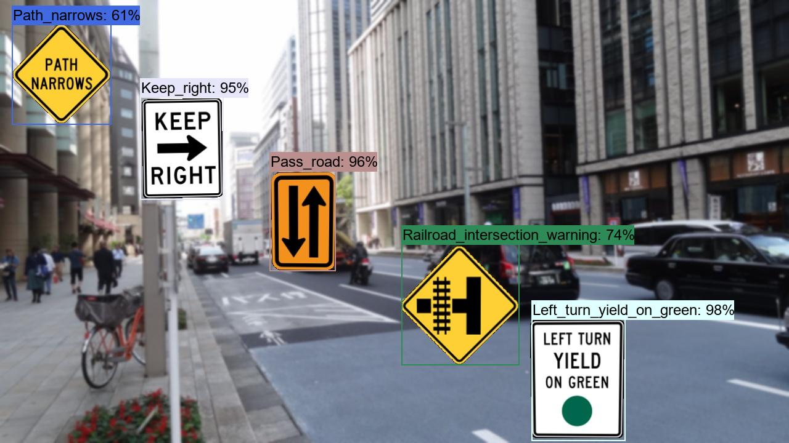 
<a  href="./projects/USA_RoadSigns/realistic_test_dataset_outputs/usa_roadsigns_1078.jpg_objects.csv">roadsigns1008.jpg_objects.csv</a> 
 
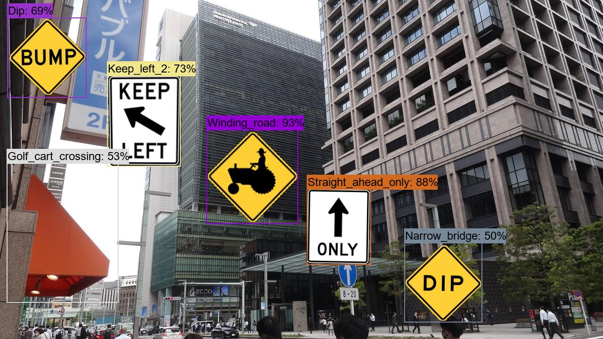 
<a  href="./projects/USA_RoadSigns/realistic_test_dataset_outputs/usa_roadsigns_1089.jpg_objects.csv">roadsigns1009.jpg_objects.csv</a> 
 
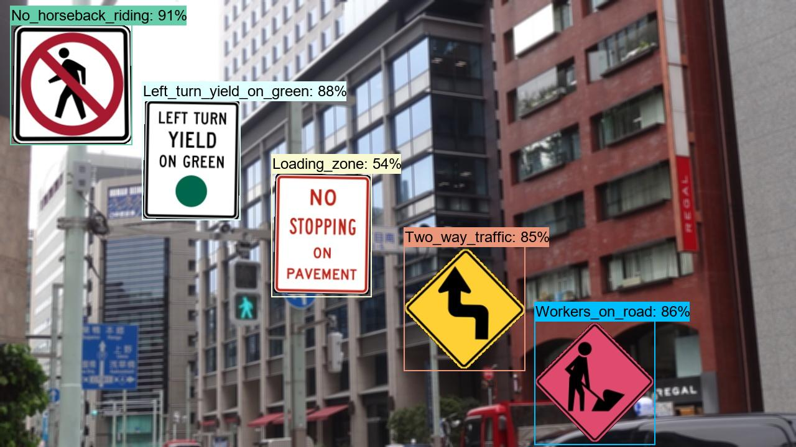 
<a  href="./projects/USA_RoadSigns/realistic_test_dataset_outputs/usa_roadsigns_1099.jpg_objects.csv">roadsigns1010.jpg_objects.csv</a> 
 

<h3>9. COCO metrics of inference result</h3>
The 3_inference.bat computes also the COCO metrics(f, map, mar) to the <b>realistic_test_dataset</b> as shown below: 
<a href="./projects/USA_RoadSigns/realistic_test_dataset_outputs/prediction_f_map_mar.csv">prediction_f_map_mar.csv</a>

 
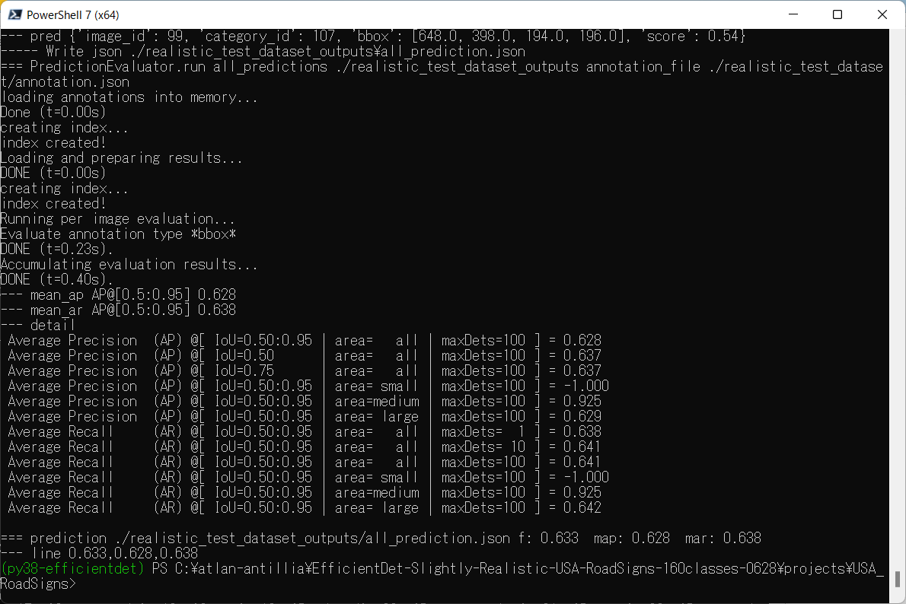 

